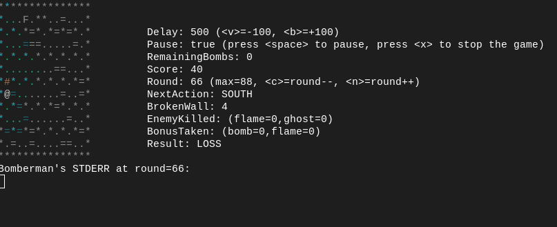
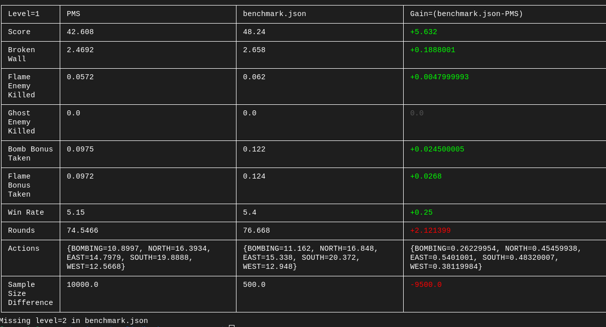

# bomberman-cli

A user-friendly way to work on the assigned bomberman projects.
This tool was designed as a complete toolchain to work on one of my assigned
projects.

*Tested on Gentoo Base System release 2.14. This should work on any linux
distribution. It should also work on macOS without any changes. It was not
tested on Windows, but high chances it will simply not work.*

**`manage-bomberman-cli.sh` was made for Linux only**

## Installation: 'I am a package manager part.'

To install bomberman-cli, you must compile it from source after patching it
properly (adding data in `code.zip` provided on Moodle).

*You must patch it yourself, as no license was provided with code.zip allowing
this kind of tool being open-sourced.*

You need those dependencies first.

- unzip (compile-time)
- git (compile-time)


- Java17 >= (runtime)

After installing, you can remove the `code.zip` file as it is now useless.

### Script Installation

This can be achieved with the provided `manage-bomberman-cli.sh`.

Simply run `manage-bomberman-cli.sh install /path/to/code.zip`.

`manage-bomberman-cli.sh` can be run as root or not.
It is easier to use if it is installed as root (and lets you install bash auto-completion).

#### Root Mode

`manage-bomberman-cli.sh` will install bomberman-cli in `/usr/local/bin` and will also try to
install the autocompletion suite. You can choose to install it or not.

#### User Mode

`manage-bomberman-cli.sh` will install bomberman-cli as its jar format in the working directory.
You'll be able to use it with `java -jar bomberman-cli.jar`

## Removal

Only root mode removal is supported.
Run `manage-bomberman-cli.sh uninstall`.

## Usage

This tool comes with 4 different commands.
- `compile`
- `play`
- `benchmark`
- `compare`

You can look at their respective help message by running:
`bomberman-cli <command> --help`

All those commands can be used directly simply by following their respective `--help` message.

## Examples

### The `play` command

To play the first level of bomberman with complete control over the game, do:  
`bomberman-cli play -0`

*If no player.c is provided with `--player-c` then the default `./player.c` is used.*

The terminal will look like this:


You can press on the (`<v>`, `b`, `<space>`, ...) to manipulate how the
game is being displayed.

Note that the stderr of the player.c is being displayed on the screen.
It is refreshed at each round. So if you `fprintf(stderr, "hello world!");`
inside the `action bomberman(...)` function then you'll see it there.

If you've used `printf` and not `fprintf(stderr, ...)` you can launch the play
command with `--stdout-as-stderr`.

After playing around you can quit the game with `<x>`. You'll then see a `BombermanGameResult`
to summarize your game.

### The `benchmark` command

You can use this command to see how your player.c performs:  
`bomberman-cli play --json benchmark.json --levels 0 1 2 --games 5000`

*If your player.c is really heavy you can use `--timeout >2000` to avoid certain games
being marked as TIMEOUT even though `bomberman-cli --seed <their-seed> --level i` finishes
properly.*

You'll then be prompted to wait with a progress bar. After a while, you'll see something like:
```
problematicSeeds=<seeds>
Computed: 5000 games (per level) in 8m 19.421312575s.
Data has been written to 'benchmark.json'.
```

`benchmark.json` contains all the wanted information about the batch of games that were played.

### The `compare` command

You can compare 2 player.c benchmarks together or compare one benchmark to the *random move among
all possible ones* strategy.

`bomberman-cli compare benchmark.json`  

You'll get something similar to:


The table is pretty straight forward.

*If you've created a benchmark ommiting some levels, then a message similar to the one in the
bottom of the picture will be printed.*

## Miscellaneous

If you ever need any help running bomberman-cli you can open an issue on this page. 

Any contribution is appreciated and can be done by opening an issue, or directly submitting
a pull request.


### Thanks to Jetbrains for providing an educational license for Idea Ultimate.

[](https://www.jetbrains.com/community/education/#students)
